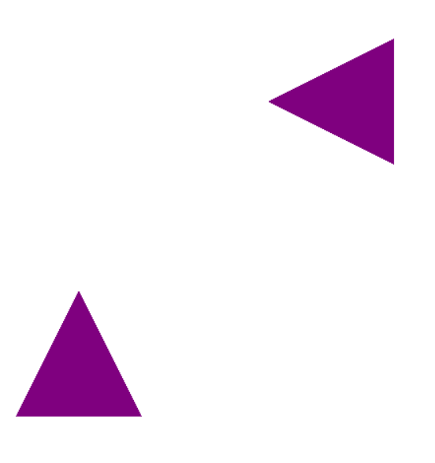
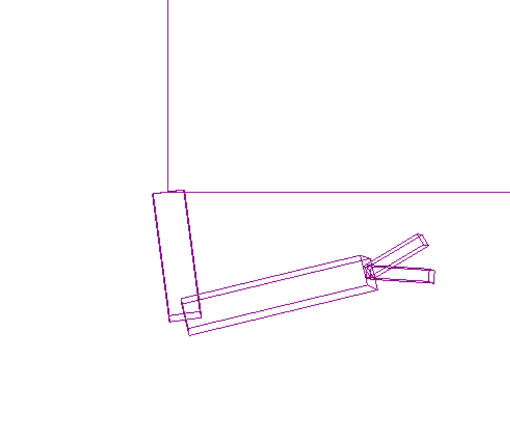
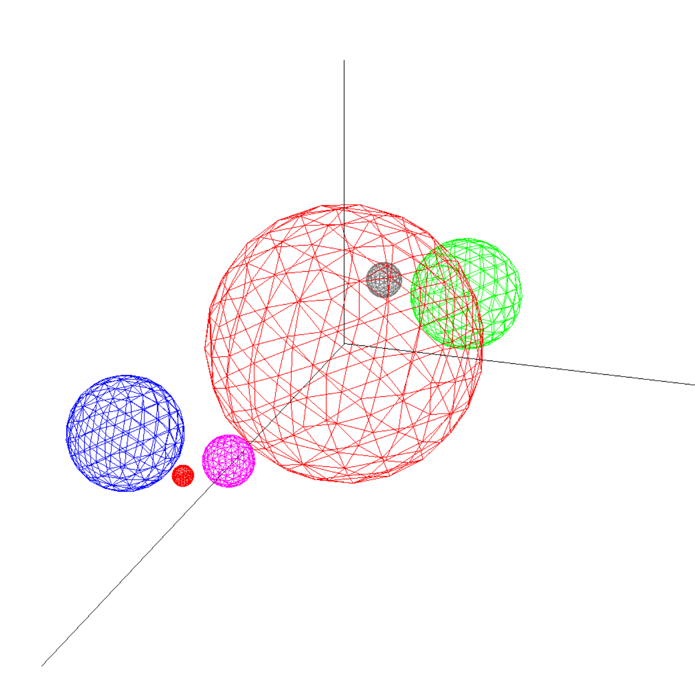

# Labs – Computer Graphics

---

## 📂 Lab 1

### 📖 Description
In this lab:
1. Rotation of a square constructed from lines around the center of the screen, repeated n times, using a specified angle
2. Translation of a square such that its center follows the circumference of a circular arc centered at the screen center
3. Drawing an airplane defined by points in its local coordinate system, scaled and translated in four directions, and rotating a separate instance around the screen center using a timer-based animation

### 🖼️ Screenshot

  
  
  

---

## 📂 Lab 2

### 📖 Description

Plotting of four mathematical functions— $\tan(x)$, $\sin(10x)$, $x\sin(10x)$, and $(x^2 - 2)(x + 3)$—using polyline approximation to render smooth curves. 

### 🖼️ Screenshot

  

---

## 📂 Lab 3

### 📖 Description

In this lab:
1. Setting up the programmable OpenGL pipeline by implementing Vertex and Fragment shaders to transform 3D data into pixels.
2. Managing GPU memory through Vertex Buffer Objects (VBO) for data storage and Vertex Array Objects (VAO) for attribute organization.
3. Initializing windows and handling events (mouse, keyboard, display) using FreeGlut callback functions.
4. Rendering geometric primitives to create a square and a circle, including the use of Index Buffer Objects (IBO) for efficient drawing

### 🖼️ Screenshot

  

## 📂 Lab 4

### 📖 Description

This lab focuses on the Programmable OpenGL Pipeline, specifically the implementation of Vertex Shaders and the communication between the CPU (C++) and GPU using GLSL. Key topics include:
1. GLSL (OpenGL Shading Language): Understanding the high-level, C-like language used to control the rendering pipeline, including its built-in variables like gl_Position.
2. Vertex Shaders: Programming the first stage of the pipeline to determine vertex positions in the World Coordinate System (WCS).
3. Uniform Variables: Using uniform qualifiers to pass global data—such as transformation matrices or translation vectors—from the C++ application to shaders via glUniform.
4. Modeling Transformations: Applying basic geometric operations (Translation, Rotation, Scaling) using the GLM library and understanding the impact of matrix multiplication order.
5. Dynamic Animation: Implementing a "Bouncing Sphere" effect by varying translation parameters over time using trigonometric functions ($y = radius + |3 \cdot \sin(time)|$).
6. Complex Mesh Loading: Initializing and rendering more complex geometries like spheres using Vertex Buffer Objects (VBO), Vertex Array Objects (VAO), and Element Buffer Objects (EBO).
### 🖼️ Screenshot

  

## 📂 Lab 6

### 📖 Description

In this lab, the focus is on the OpenGL Visualization System, specifically handling hierarchical modeling and matrix stacks to create complex, articulated scenes. Key concepts include:

1. Matrix Stack Management: Using glPushMatrix and glPopMatrix to manage local and global coordinate systems, allowing objects to inherit transformations from their "parents."

2. Compound Transformations: Implementing the correct order of operations (Translation, Rotation, Scaling) to ensure articulated movements without breaking the object's geometry.

3. Hierarchical Robot Arm: Developing a multi-segment robotic arm where the movement of the forearm depends on the shoulder, and the fingers follow the forearm's orientation, including "shearing" movements.

4. Solar System Simulation: Modeling a dynamic system where planets orbit the sun and satellites orbit planets, using relative transformations and self-rotation logic.

### 🖼️ Screenshot

  

