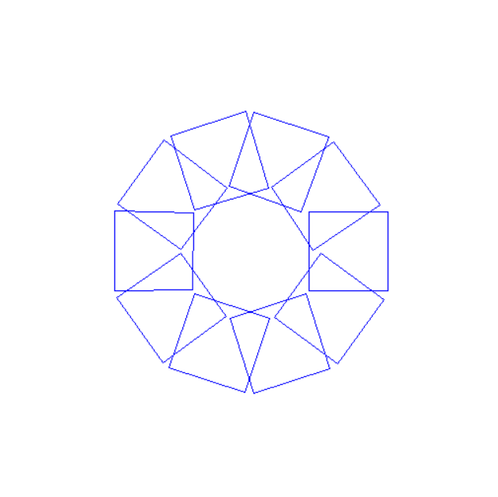
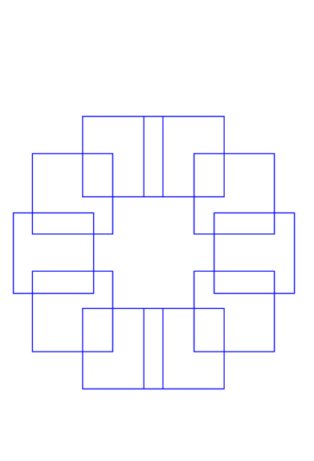
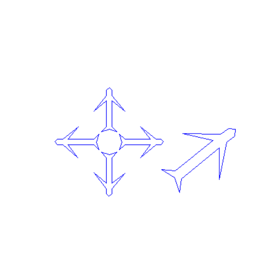
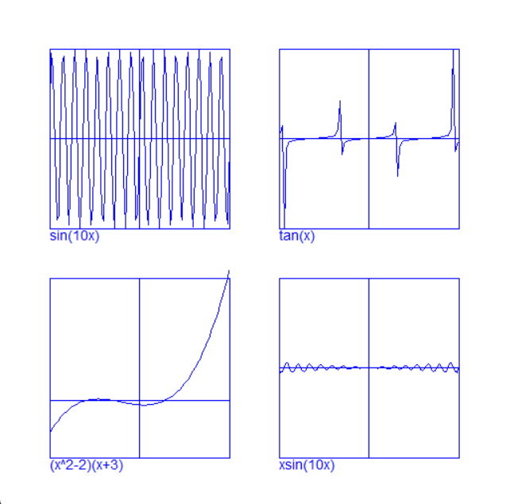
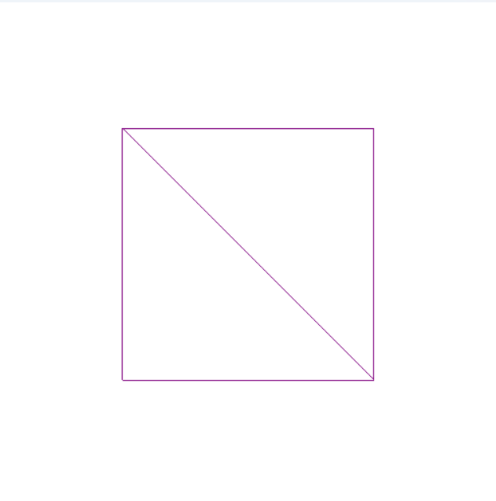
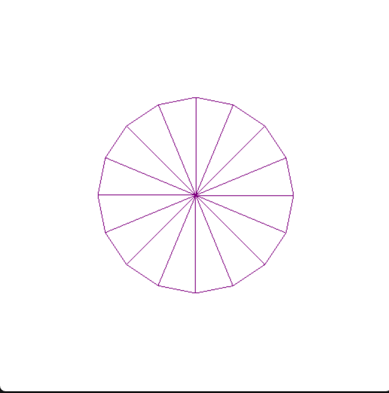

# Labs – Computer Graphics

---

## 📂 Lab 1

### 📖 Description
In this lab:
1. Rotation of a square constructed from lines around the center of the screen, repeated n times, using a specified angle
2. Translation of a square such that its center follows the circumference of a circular arc centered at the screen center
3. Drawing an airplane defined by points in its local coordinate system, scaled and translated in four directions, and rotating a separate instance around the screen center using a timer-based animation

### 🖼️ Screenshot

  
  
  

---

## 📂 Lab 2

### 📖 Description

Plotting of four mathematical functions— $\tan(x)$, $\sin(10x)$, $x\sin(10x)$, and $(x^2 - 2)(x + 3)$—using polyline approximation to render smooth curves. 

### 🖼️ Screenshot

  

---

## 📂 Lab 3

### 📖 Description

In this lab:
1. Setting up the programmable OpenGL pipeline by implementing Vertex and Fragment shaders to transform 3D data into pixels.
2. Managing GPU memory through Vertex Buffer Objects (VBO) for data storage and Vertex Array Objects (VAO) for attribute organization.
3. Initializing windows and handling events (mouse, keyboard, display) using FreeGlut callback functions.
4. Rendering geometric primitives to create a square and a circle, including the use of Index Buffer Objects (IBO) for efficient drawing

### 🖼️ Screenshot

  

